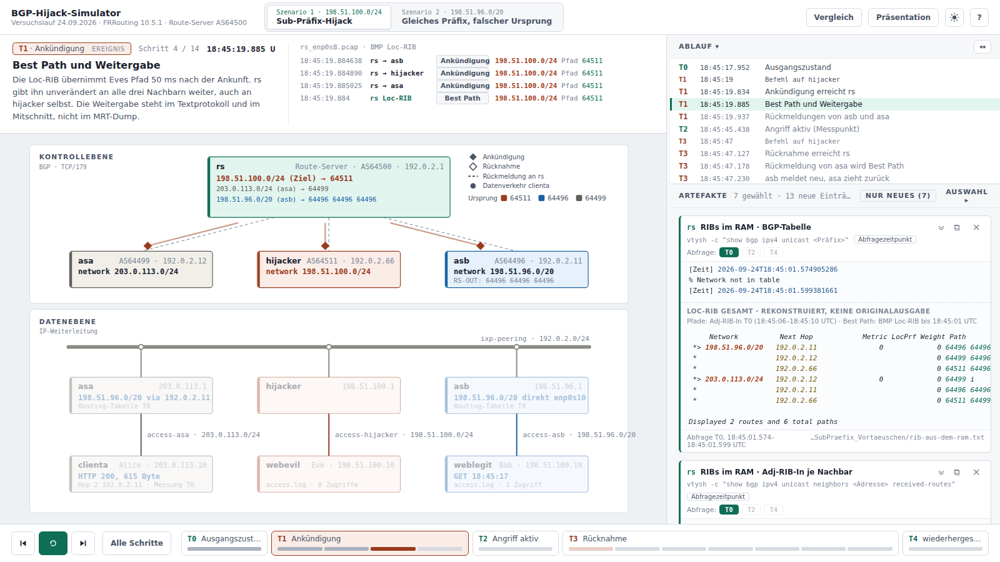

# BGP-Hijack-Simulator

Interaktive Wiedergabe eines Versuchslaufs zu BGP-Hijacking an einem Route-Server
(FRRouting 10.5.1, AS64500) vom 24.09.2026. Zwei Szenarien werden Schritt für Schritt
durchlaufen – mit Netzplan (Kontroll- und Datenebene) und den zugehörigen Artefakten
des Route-Servers und der übrigen Systeme.

**Direkt im Browser:** https://qayxswe.github.io/bgp-hijack-simulator/

## Szenarien

| | Szenario 1 · Sub-Präfix-Hijack | Szenario 2 · Gleiches Präfix, falscher Ursprung |
|---|---|---|
| Eve kündigt an | `198.51.100.0/24`, spezifischer als Bobs `198.51.96.0/20` | `198.51.96.0/20`, dasselbe Präfix wie Bob |
| Warum Eve gewinnt | längste Präfixübereinstimmung | kürzerer AS-Pfad (1 statt 3 Einträge) |

Jedes Szenario durchläuft die Phasen **T0** Ausgangszustand, **T1** Ankündigung,
**T2** Angriff aktiv, **T3** Rücknahme und **T4** wiederhergestellter Zustand.
Am Ende stellt die Ansicht **Vergleich** beide Szenarien mit Kennzahlen aus den
Primärdaten gegenüber.

## Starten

Keine Installation nötig: `index.html` im Browser öffnen (auch offline, per `file://`).
Mit `index.html#s2-6` springt man direkt zu Szenario 2, Schritt 6; mit
`index.html?a=rs-bmp,rs-pcap#s1-1` startet man mit einer bestimmten Artefaktauswahl.

## Bedienung

| Taste | Wirkung |
|---|---|
| `←` `→` / `Bild ↑` `Bild ↓` | Schritt zurück/vor – durchgehend: Szenario 1 → Szenario 2 → Vergleich (Presenter geeignet) |
| `Leertaste` | Animation des Schritts anhalten/wiederholen |
| `0`–`4` | Phase T0–T4 |
| `S` | Szenario wechseln |
| `K` | Kernschritte: nur 8 tragende Schritte je Szenario (für kurze Vorträge) |
| `P` | Präsentation: Seitenleiste ausblenden, Netzplan in voller Breite |
| `V` | Vergleich der Szenarien |
| `N` | im Vollbild-Log: Netzplan daneben/darüber |
| `Esc` | Fenster schließen |

Weitere Hinweise zur Bedienung und zur zeitlichen Einordnung stehen in der Hilfe (`?`).

## Datengrundlage

Alle Protokollzeilen, Abfragen und Mitschnitte sind wörtlich aus den Primärdaten des
Versuchslaufs übernommen (`js/rohdaten.js`, erzeugt mit `werkzeug/rohdaten-erzeugen.ps1`).
Abgeleitete Darstellungen – etwa die rekonstruierte Loc-RIB aus BMP und Adj-RIB-In –
sind in der Oberfläche als Rekonstruktion gekennzeichnet. Alle Adressen stammen aus dem
Laboraufbau (Dokumentationsbereiche nach RFC 5737 bzw. ein Labor-Präfix).
